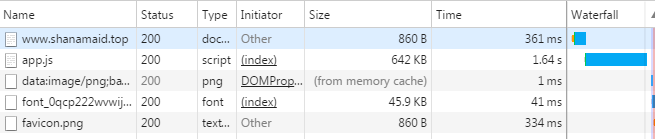
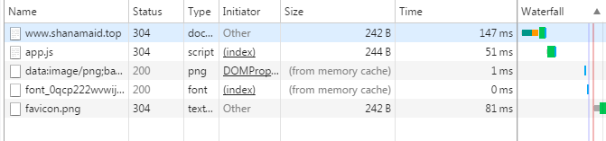
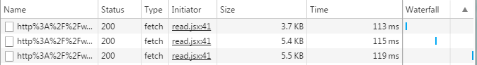

#### nodejs环境需求
nodejs v4.5.0版本
设置国内镜像
`npm config set registry https://registry.npm.taobao.org `
npm3(安装完毕nodejs后升级npm3: `npm -g install npm@3`)

#### chrome安装如下插件辅助开发:
- React Developer Tools
- Redux DevTools
- livereload

#### 先执行一次包更新
`npm install`

#### 开发执行(常驻后台即可)
`npm start`

#### 访问地址
http://localhost:8000

#### 强力工具库lodash建议使用
http://lodashjs.com/docs (建议最小导入使用 eg: `import _isEmpty from 'lodash/isEmpty'`)

#### 附加的图标和按钮库
```
import SysIcon from 'SysIcon'
import Buttons from 'Buttons'
```
基于react的移动阅读APP优势
=========================
## 基于react的移动阅读APP优势
|     | 基于react的移动阅读APP |  追书神器等其他移动阅读APP |
|-----|-----------|----------|
|收费 | 免费      |部分章节免费,其余收费|
|广告 |绿色无广告 | 定时刷广告|
|体积 | 4MB     | 16.2MB   |
|章节大小| 每章5kb左右   | 掺杂广告，大于5kb|

基于react的移动阅读APP初次打开时候加载比较慢，一部分原因是服务器带宽较小，另一部分是因为初次需要下载`700kb`左右的文件，建议初次下载在wifi下进行。初次下载后基于react的移动阅读APP会自动进行缓存，以后每次打开页面基本是秒开，消耗流量约在`1KB`不到。



初次打开消耗流量约在700kb左右



后续打开消耗流量约在1kb不到

同时基于react的移动阅读APP抛弃所有与小说阅读无关的信息，真正做到极简！保证每一分流量都用到小说内容的阅读上，真正做到每章内容加载所用的流量集中在小说章节内容上，视章节字数而定，一般在`5kb`左右。



每章流量消耗


## 实现功能
- [x] 移动阅读APP首页(宫格模式和列表模式)
- [x] 移动阅读APP阅读页(皮肤[字体/背景]、章节切换、夜间模式、目录)
- [x] 移动阅读APP换源页(内容换源)
- [x] 移动阅读APP搜索页
- [x] 移动阅读APP详情页(用户操作和详细信息)
- [x] 下拉刷新列表
- [x] 分享复制
- [x] 阅读设置本地缓存
- [x] 阅读进度本地缓存
- [x] 搜索历史本地缓存

下拉首页小说列表可以刷新小说章节列表信息缓存！

## 目录结构
```
|
|—— api API说明
|—— cfg webpack配置
|—— dist 服务端
| |—— app.js 服务端启动入口文件
| |—— assets 打包后的资源文件
| |—— static 静态资源
| |__ index.html 网页入口
|
|——src 资源文件
| |—— images 图片资源
| |—— components 组件库
| |—— method  一些自定义方法，目前是过滤器
| |—— filters 自定义过滤器
| |—— redux
| | |—— action
| | |—— reducer
| | |__ store
| |—— router 路由管理
| |—— styles 样式文件
| |__ index.jsx 入口
|_________________________________________________

```

## 一些注意事项
项目中使用追书神器的接口，需要使用`http-proxy-middleware`进行转发，开发环境下需要在`cfg/base.js`中的`dev`中添加下列配置即可
```
proxy: {
  '/api': {
    target: 'http://api.zhuishushenqi.com/',
    pathRewrite: {'^/api' : '/'},
    changeOrigin: true
  },
  '/chapter': {
    target: 'http://chapter2.zhuishushenqi.com/',
    pathRewrite: {'^/chapter' : '/chapter'},
    changeOrigin: true
  }
}
```

实际环境中，服务器端配置
```
var express = require('express');
var proxy = require('http-proxy-middleware');

var app = express();
app.use('/static', express.static('static'));
app.use('/assets', express.static('assets'));
app.use('/api', proxy({
  target: 'http://api.zhuishushenqi.com/',
  pathRewrite: {'^/api' : '/'},
  changeOrigin: true
}
));

app.use('/chapter', proxy({
  target: 'http://chapter2.zhuishushenqi.com/',
  pathRewrite: {'^/chapter' : '/chapter'},
  changeOrigin: true
}
));

app.get('/*', function (req, res) {
  res.sendFile(__dirname + '/index.html');
});
app.listen(3001);
```

##### 开发注意要点

*模块开发自带的样式放在本模块下面,图片放到公共目录下(src/common/img)*

*一般不要覆盖ant的样式，有需要在entries/index.less里覆盖。页面布局采用ant的row,col布局不要另外单独写样式布局*

*模块主入口文件使用.js后缀，模块部件放到子文件夹`./components下`,并以.jsx为后缀*

##### 后台交互说明
开发环境调用后台路径配置：
`proxy.config.js`文件下可以自由定义接口调用到的后台地址，业务模块不要出现应用路径(BackGround)；

各个模块目录下：
- api.js      定义与后台交互的接口方法
- action.js   定义页面操作触发的动作(eg. 点击查询按钮)
- reducer.js  定义触发动作后的影响(eg. 查询完成后将查询结果set回state，视图自动刷新)
参考交互模块：finance/invoice

##### 依赖注入说明
*每个模块有自己的state用来统一管理视图数据*

- 将需要的state的节点注入到与此视图数据相关的组件上
```
function mapStateToProps(state, ownProps) {
	return {
			loading:state.getIn(['projectPre','projectMgr','loading']),
      ...
	}
}
```

- 将需要绑定的响应事件注入到组件上
```
function mapDispatchToProps(dispatch){
	return {
		...bindActionCreators(action, dispatch)
	}
}
```
React 开发规范
========================
###### React内置类型
```
React.PropTypes类型列表 (任何类型在最后加上isRequired则此在使用此组件时必须赋值)
React.PropTypes.array,//数组类型
React.PropTypes.bool,//布尔值类型
React.PropTypes.func,//函数类型
React.PropTypes.number,//数值类型
React.PropTypes.object,//JS对象类型
React.PropTypes.string, //字符串类型
React.PropTypes.node, // 所有可以被渲染的对象    
React.PropTypes.element,  // React 元素
React.PropTypes.oneOf(['News', 'Photos']), //只接受其中一个值的枚举类型
React.PropTypes.oneOfType([React.PropTypes.string, React.PropTypes.number     ]),
React.PropTypes.arrayOf(React.PropTypes.number), // 指定类型组成的数组
// 指定类型的属性构成的对象
 React.PropTypes.objectOf(React.PropTypes.number),
// 特定形状参数的对象
 React.PropTypes.shape({
  color: React.PropTypes.string,
  fontSize: React.PropTypes.number
}),
```
###### React生命周期
```
  挂载		
		componentWillMount   挂载前		
		componentDidMount	挂载后
	更新		
		componentWillUpdate		更新前		
		componentDidUpdate		更新后
		componentWillReceiveProps	当接收到props时		参数:nextProps
	    shouldComponentUpdate		是否执行更新
	卸载		
		componentWillUnmount
```
###### React注意要点
- 所有的组件render返回的标签，最外层只能有一个根标签
- `defaultValue`只有在组件第一次渲染才起作用，除非组件被销毁后重建，所以直接通过state或者props里的value来控制组件的value([受控组件与非受控组件](http://www.cnblogs.com/qingguo/p/5857923.html))
- 通过遍历器(for in, forEach, []数组)生成的控件一定要给每一条记录对应的控件key作唯一区分
- 组件的分拆代码可以放在一个数组变量里，然后用{变量名}引入，数组形式可以省掉最外层的唯一标签了

Ant Design 组件库注意要点
=============================
- [在线帮助文档](https://ant.design/docs/react/introduce-cn)
- 目前的版本(v2.2.1)的表单resetFields对某些类型DatePicker无效，需要手工setFieldsValue为空
- 前台生成列表序号列`render: (text,record,index) => ++index`
- 列的render方法是一个函数，里面可以根据单元格值返回不同的包装值，可以返回图片缩略图，可以返回编辑控件
```
value是当前单元格的值，record是当前行的值, index是序号从0开始
render: (value, record, index) => {
  if (conditon1) {
    return xxx;
  } else {
    return xxx;
  }
  //返回编辑框，这里的input是一个受控组件
  return <Input size="default" value={value} />
}
```

目前的扩展组件
================================
- `SearchInput` 带查询按钮的输入框，支持自动完成
- `TitleWithTools` 左边有个蓝色竖条的排版分段组件
- `ShowHide` 可展开收起的面板，一般用于查询表单容器
- `SearchPanel` 查询表单，带普通/高级查询tabs
- `FullPagePanel` 全屏弹出显示，用于需要三级路径的模块
- `DataHeader` 复杂单据的分段排版
- `StateMark` 销控状态统一标记
- `MianBao` 面包屑控件
- `AppAction` 全局action，用于全局状态变更
- `ProjectTree` 项目树面板组件
- `ProTreSelect` 项目树下拉框组件
- `MsgBox` 统一风格的消息弹出提示，用法参考ant的`Modal`
- `util` 工具类(缓存操作，DataUtil.getProjDataById根据项目id获取项目节点对象)
- `ProCascader` 项目组级联组件，有别于树的形式
- `DictItemSelect` 字典下拉选择组件
- `DictItemDisplay` 字典纯显示组件
- `CommonParamSelect` 公共参数下拉组件
- `SysIcon` 扩展图标库(销售系统专用)
- `Buttons` 扩展按钮库(带图表，销售系统专用)
- `JCFWSelect` 服务类型下拉框(入伙服务...)

路由相关说明：
================================
##### 一、`<Link>`标签

Link组件用于取代`<a>`元素，生成一个链接，允许用户点击后跳转到另一个路由。它基本上就是`<a>`元素的React 版本，可以接收Router的状态。
```
render() {
  return <div>
    <ul role="nav">
      <li><Link to="/about">About</Link></li>
      <li><Link to="/repos">Repos</Link></li>
    </ul>
  </div>
}
```
如果希望当前的路由与其他路由有不同样式，这时可以使用Link组件的activeStyle属性。

```
<Link to="/about" activeStyle={{color: 'red'}}>About</Link>
<Link to="/repos" activeStyle={{color: 'red'}}>Repos</Link>
```
上面代码中，当前页面的链接会红色显示。
另一种做法是，使用activeClassName指定当前路由的Class。

```
<Link to="/about" activeClassName="active">About</Link>
<Link to="/repos" activeClassName="active">Repos</Link>
```
上面代码中，当前页面的链接的class会包含active。
在Router组件之外，导航到路由页面，可以使用浏览器的History API，像下面这样写。
```
import { browserHistory } from 'react-router';
browserHistory.push('/some/path');

```
##### 二、IndexLink

如果链接到根路由/，不要使用Link组件，而要使用IndexLink组件。
这是因为对于根路由来说，activeStyle和activeClassName会失效，或者说总是生效，因为/会匹配任何子路由。而IndexLink组件会使用路径的精确匹配。
```
<IndexLink to="/" activeClassName="active">
  Home
</IndexLink>

```
上面代码中，根路由只会在精确匹配时，才具有activeClassName。
另一种方法是使用Link组件的onlyActiveOnIndex属性，也能达到同样效果。
```
<Link to="/" activeClassName="active" onlyActiveOnIndex={true}>
  Home
</Link>

```
实际上，IndexLink就是对Link组件的onlyActiveOnIndex属性的包装。

##### 三、组件里通过响应函数跳转
- 方式1:
```
组件类声明如下
static contextTypes = {
  router: React.PropTypes.object.isRequired,
  location: React.PropTypes.object.isRequired
};
然后在需要控制跳转的地方
	this.context.router.push('/xxx');
```
- 方式2
```
导入公共action
import * as AppAction from 'AppAction'
依赖注入action
function mapDispatchToProps(dispatch) {
  return {
    ...bindActionCreators(AppAction, dispatch)
  }
}
需要跳转的地方触发action
this.props.changeLocation('/xxx', params); [可以通过params来传参数]
被打开的页面接收参数
this.props.location.query.xxx
```

Redux相关说明
==========================
##### 表单在生产环境输入框修改无效问题
表单组件不能是纯函数写法，要用如下写法：
```
xxx extends React.Component
```
或者
```
import { createForm } from 'enhanceUtil'
...
createForm((props)=>{...});
```

##### 修改状态后不生效的问题
使用深度clone保证reucer返回回去的对象为新对象 `_.deepClone`(也可以使用Immutable)

##### Redux连接后的组件refs生效的方法(第四个参数)
`connect(mapStateToProps, mapDispatchToProps, null, { withRef: true })(Content);`
